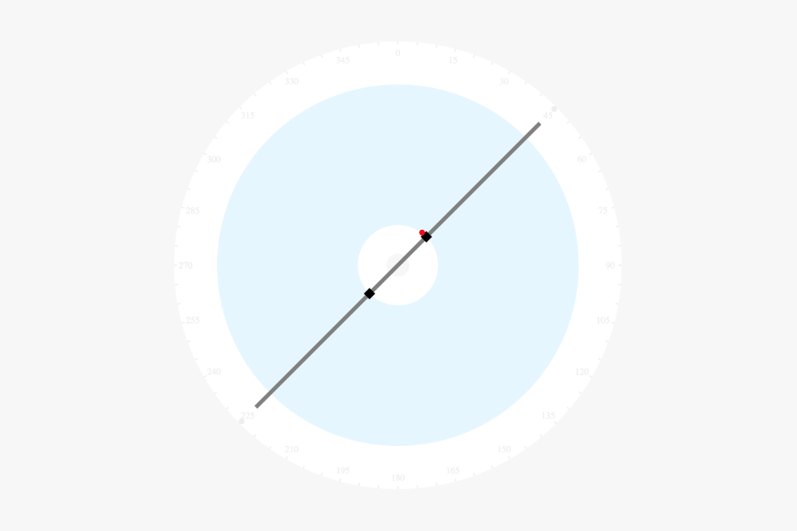

# Roplot Visualiser
This repository holds a Javascript visualisation specifically designed for the [Roplot](http://roplot.com/) drawing robot. The visualisation depicts the drawing robot and can be animate simulate the movements of the physical Roplot drawing robot.



## Dependancies
* [JQuery 3.3.1+](https://jquery.com/)
* [D3 v5](https://d3js.org/)

## Basics
The project is structured as a JQuery Plugin. It can be initialised as follows:

```html
    <link href="roplot.css" rel="stylesheet">
    <script src="https://d3js.org/d3.v5.min.js"></script>
    <script src="https://code.jquery.com/jquery-3.3.1.min.js" integrity="sha256-FgpCb/KJQlLNfOu91ta32o/NMZxltwRo8QtmkMRdAu8=" crossorigin="anonymous"></script>
    <script src="roplot.js"></script>
    <script>
        settings = {
            "physical": { 
                "boomRadius": 500,      // Radius of the boom
                "boomWidth": 10,        // Width of the boom
                "boomColor": "gray",    // Boom colour
                "drawStart": 100,       // Distance from boom center where carriage stops - inner
                "drawEnd": 450,         // Distance from boom center where carriage stops - outer
                "carWidth": 20,         // Carriage Width - axis normal to boom
                "carHeight": 20,        // Carriage Height - axis parallel to boom
                "pens": [{
                    "pole": "north",    // Which half of the boom is the carriage on. North or South
                    "color": "red",     // Color of the pen
                    "offsetX": 15,      // X Offset of pen tip from center of boom width
                }]
            },
            "clock": {
                "tickInterval": 5,      // Interval in degrees between tick marks
                "LabelInterval": 15     // Interval in degrees between tick labels
            }
        }
        $('#roplotter').roplot(settings);
    </script>
```

To rotate the boom:

```js
$('#roplotter').boomTo(degrees); // Where 'degrees' is an integer between 0 and 359
```

To move the pen carriage:

```js
$('#roplotter').carTo(mm); // Where 'mm' is the physical distance from the pivot to the destination of the pen tip
```

## Events
To facilitate interaction the plugin fires events. These events can be listened to by attaching a listener. For example:

```js
$('#roplotter').on('click', function(e, details) { console.log(details); });
```

| Events        | Description  |
| ------------- |:-------------|
| click         | When the visualisation is clicked on |
| mousemove     | When the mouse moves over the visualisation |
| boomAnimEnd   | When the boom animation ends |
| carAnimEnd    | When the carriage animation ends |


The **click** and **mousemove** events return details of the mouse position relative to the center of the plotter i.e. its point of pivot.

```js
{
    cxOffset: 210.40    // X Offset from devices central pivot
    cyOffset: 18.59     // Y Offset from devices central pivot
    degrees: 84.95      // Angle in degrees
    radians: 1.48       // Angle in radians
    inDrawSpace: true   // Is the mouse in the drawable area
    originalX: 600      // X Position relative to top left of element
    originalY: 371      // Y Position relative to top left of element
    radius: 211.22      // Distance between mouse and pivot 
} 
```
